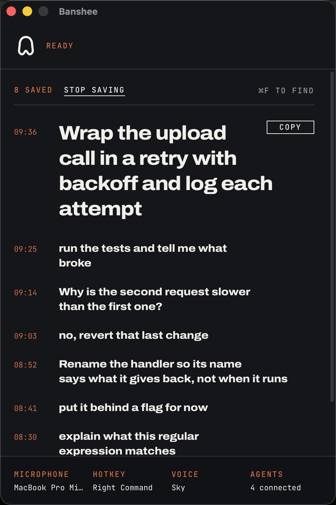
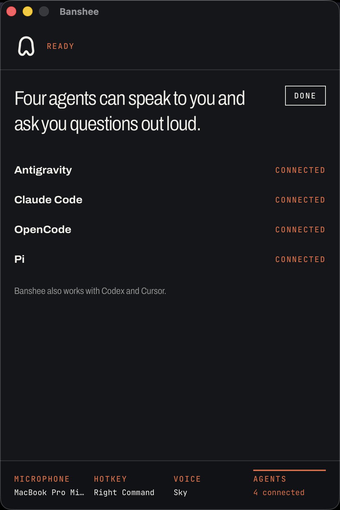

<p align="center">
  
</p>

# Banshee

Banshee gives your AI coding agent a voice. It speaks its decisions and
questions out loud, and you answer by talking, hands-free, while it works.
Everything runs on your machine: local Whisper for listening, a local neural
voice for speaking. No API keys, no audio leaving your laptop.

It is a dictation tool too: hold a hotkey, speak, and the text lands in
whatever app you are focused on.

## Demo

<https://github.com/user-attachments/assets/006132bd-9710-4322-a35a-4a5e5004371c>

The daemon running with the Pi coding agent. It asks which language to use,
hears "let's go with python", and writes the file. Nothing was typed.

## Install

|                       | Daemon, CLI, agent voice, dictation | Desktop window |
| --------------------- | ----------------------------------- | -------------- |
| macOS (Apple Silicon) | yes                                 | yes            |
| Linux (x86_64, arm64) | yes, with [setup](docs/linux.md)    | not yet        |
| Windows               | not yet                             | not yet        |

Needs ~1 GB of disk for the models. Intel Macs are not supported.

```bash
brew install yamanahlawat/banshee/banshee
```

Or without Homebrew:

```bash
curl --proto '=https' --tlsv1.2 -LsSf \
  https://github.com/yamanahlawat/banshee/releases/latest/download/banshee-installer.sh | sh
```

Both install the daemon, the CLI and the menu bar icon. For the desktop window,
add the app bundle:

```bash
curl -fsSL https://github.com/yamanahlawat/banshee/releases/latest/download/Banshee.app.tar.gz \
  | tar -xzf - -C /Applications
```

Writing to `/Applications` needs an admin account. Without one, run
`mkdir -p ~/Applications`, extract there instead, and read that path
everywhere below.

The bundle carries all four binaries, so it is a whole install on its own. Run
`/Applications/Banshee.app/Contents/MacOS/banshee start` once, or link that
binary onto your `PATH`.

Banshee is signed but not yet notarised, so macOS refuses a copy that arrives
carrying a quarantine flag. `curl` sets none, which is why the command above is
a `curl`. If you download the tarball in a browser instead, clear the flag once:

```bash
xattr -dr com.apple.quarantine /Applications/Banshee.app
```

To build it yourself, clone the repo and run `make install` (see
[CONTRIBUTING.md](CONTRIBUTING.md)); `cargo install --path bansheed` builds the
CLI and the daemon alone.

## Set up

With the app bundle installed, the desktop window does all of this for you:
open it and it fetches the models, asks for the grants and starts the daemon.
The steps below are the same work from a terminal.

**1. Download the models** (~860 MB: Whisper, Silero VAD, Kokoro):

```bash
banshee setup
```

An interrupted download resumes, and a re-run fetches only what is missing.

**2. Grant the macOS permissions.** Banshee needs two, or it quietly fails to
record or type: **Microphone** to capture, and **Accessibility** for the global
hotkey and for typing. macOS asks for each the first time Banshee needs it.
Approve, and the daemon restarts itself to pick the grant up.

**3. Start it, then check it:**

```bash
banshee start
banshee status
```

`banshee start` runs the daemon now and at every login. `banshee status`
reports the models, the microphone, the permissions and the daemon, and prints
a fix for anything that is off. It changes nothing itself.

## Use it

- **Hold the hotkey** (Right Option by default) and speak. On release the text
  is typed into the app you are focused on.
- **Hold `Shift` and the hotkey** to keep the text instead: `banshee listen`
  prints it.
- **The window.** Choose `Open Banshee` from the menu bar for the last
  dictation with a copy button, the day's history, and every setting. It sets
  Banshee up on its own, models and all. Quit it and dictation carries on.

<p align="center">
  
</p>

To tap once to start and once to stop instead of holding, set
`hotkey_mode = "toggle"`. The key is rebindable, and both live in
[docs/configuration.md](docs/configuration.md).

The menu bar icon answers one question: can I speak right now.

| Idle | Recording | Speaking | Waiting for you | Not running |
|:----:|:---------:|:--------:|:---------------:|:-----------:|
|  |  |  |  |  |

Waiting for you means an agent has asked a question and is holding for your
answer.

The states differ by shape, never by colour alone, and the icon is a template
image, so macOS tints it to match the menu bar in light and dark.

## Connect your coding agent

```bash
banshee connect            # which agents are installed, and which are connected
banshee connect antigravity # Antigravity IDE, agy CLI and SDK: the MCP server in ~/.gemini/config/mcp_config.json
banshee connect claude      # Claude Code: the MCP server and a stop hook that refuses to end a turn with no spoken status
banshee connect codex       # Codex CLI: the MCP server in ~/.codex/config.toml
banshee connect cursor      # Cursor: the MCP server in ~/.cursor/mcp.json
banshee connect opencode    # OpenCode: the MCP server
banshee connect pi          # Pi: the native extension
```

Each command shows the exact change to that tool's config and asks before it
writes, then you restart the tool. The Claude Code hook needs `jq` on your
PATH. Antigravity, Claude Code, OpenCode and Pi are verified on a real install;
Codex and Cursor follow their published formats and wait for a report.

Pi has its own extension API instead of MCP, so `banshee connect pi` installs a
native extension that talks to the daemon directly; see
[integrations/pi](integrations/pi).

The window's Agents panel does the same work: it lists what is installed, shows
the change before it writes, and says which agents are connected.

<p align="center">
  
</p>

`banshee-mcp-shim` is the MCP stdio server behind this. Any other MCP host takes
the same shape, with the shim's full path if the bare name does not resolve:

```json
{
  "mcpServers": {
    "banshee": {
      "command": "banshee-mcp-shim"
    }
  }
}
```

It exposes three tools:

| Tool                | What the agent does with it                                       |
| ------------------- | ----------------------------------------------------------------- |
| `speak_status`      | Say something aloud, for decisions made and work finished         |
| `ask_user`          | Ask a question aloud, then wait for and return your spoken answer |
| `listen_for_prompt` | Pick up anything you've said since it last checked                |

## More

- [docs/why.md](docs/why.md) - what Banshee does that a dictation tool does not
- [docs/configuration.md](docs/configuration.md) - every setting, the speech
  presets, the voices, and the hotkey
- [docs/cli.md](docs/cli.md) - every command
- [docs/linux.md](docs/linux.md) - Wayland hotkeys, typing, and a Waybar module
- [docs/troubleshooting.md](docs/troubleshooting.md) - what breaks, and the fix
- [CONTRIBUTING.md](CONTRIBUTING.md) - building from source, and the window

## License

Dual-licensed under [MIT](LICENSE-MIT) and [Apache 2.0](LICENSE-APACHE).
